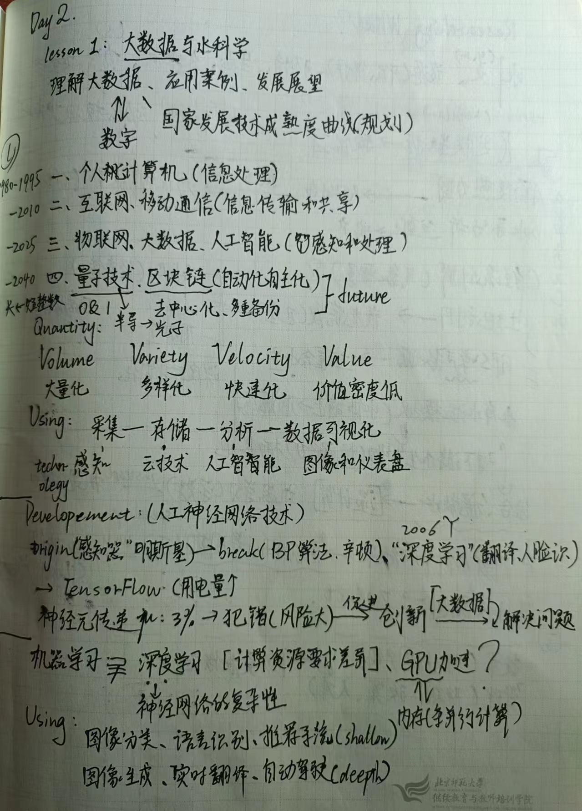
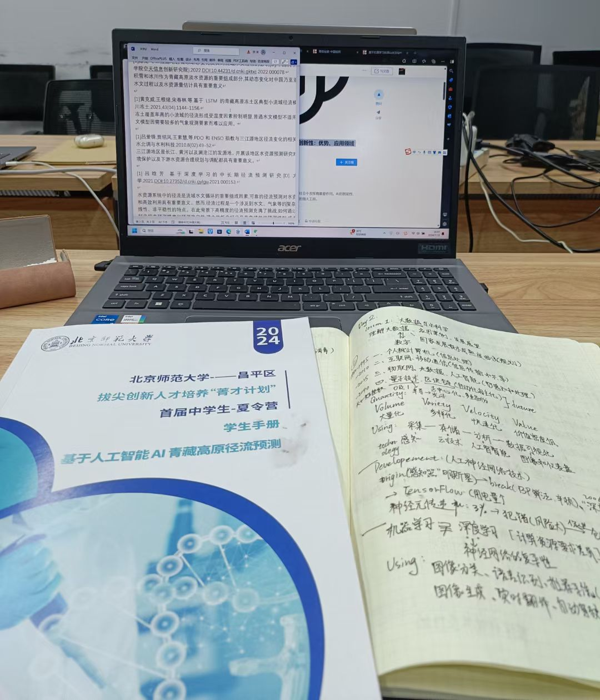
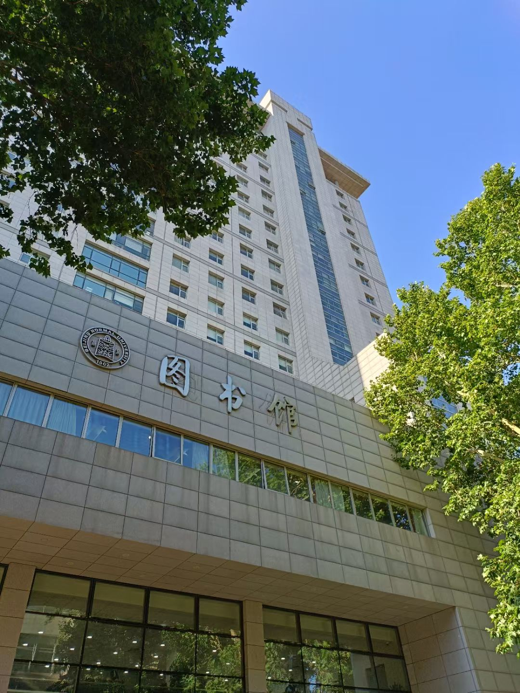

# *DAY2*

## **我的所思所学**

**morning**

- 今天的第一堂课叫：大数据与科学。鱼教授给我们从三个方面进行了介绍：理解大数据、应用案例以及其发展展望。从1980年个人计算机的诞生，人类借助外力大大提升了信息处理能力，到1995年之2010年人类使用互联网、移动通信，再到如今蓬勃发展的物联网、大数据、人工智能，机器已经能够在许多领域远远领先于人类，成为如今信息时代至关重要的工具。在这个发展趋势下的未来，新的技术还在不断被挖掘，展露出它们潜在的巨大用途，如量子技术、区块链等。在这样一个背景下，鱼教授进一步介绍了大数据的四个特点、使用技术步骤、人工神经网络技术、机器学习与深度学习的差异以及水文学科等相关概念，然后展示了几个实际案例帮助我们理解大数据在这其中如何发挥作用。讲座结尾，鱼教授对应用现状提出了改进的一个方面，并提出了具体措施。 .

+ 这一次讲座带给了我们许多启发。有人问：AI无法对输入的数据进行分辨，那如何保证其提供数据的准确性呢？的确，这个问题乍一看似乎令人不解，但鱼教授的解答让我意识到，虽然网络上存在虚假信息，但至少从整体来看，大的环境是良性的，于是最终训练出来的模型将几近正确。问题出在了我把视角聚焦到部分的个体而忽略了决定事情整体面貌的大多数情况。角度多了，看待问题的视野广了，许多问题也就迎刃而解了。.

- 等等这样引人思索的问题有许多，使上完这堂课的我不仅了解了新的知识，更拓展了我去思考问题的角度。

- 接下来，指导老师又带我们回顾了五个课题，大家进行了选题的任务，接着去了兰蕙餐厅用午餐，各自稍作休息。我进入了“基于人工智能AI青藏高原径流预测”小组。 .

**afternoon**

- 下午，我们的任务与目的十分清晰：检索相关信息。我们来到水科学研究院，打开各自的笔记本电脑。对于一个对电脑各种功能十分陌生的人来讲，这是令人不知所措又充满期待的。但在老师的带领下，我学会了在北大图书馆官网、中国知网上查找文献、如何运用关键词进行检索，切实体验了一把资料搜集的乐趣。.

- 第二天的最后一站是图书馆。这里沉淀着人类浩瀚如烟的学问智慧，却寂静无声，令人神往。我们在一柜一柜的图书中再次进行检索，如同在大数据中寻找具有价值的那一部分。.

- 检索完毕，返回宿舍的途中，忽然间下起倾盆大雨。这场大雨使图书馆的那份静谧与校园的雨落声交织在一起，在我的耳畔久久回响。

***THE END***
